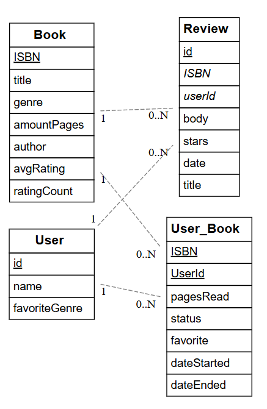

# Examenopdracht Front-end Web Development & Web Services

> Schrap hierboven eventueel wat niet past

- Student: Lisa Vercruysse
- Studentennummer: 202294679
- E-mailadres: <lisa.vercruysse@student.hogent.be>

## Vereisten

> Vul de vereisten eventueel aan

Ik verwacht dat volgende software reeds geïnstalleerd is:

- [NodeJS](https://nodejs.org)
- [pnpm](https://pnpm.io)
- [MySQL Community Server](https://dev.mysql.com/downloads/mysql/)

> Je kan ook een aparte README per project (in de respectievelijke map) voorzien. Verwijs er dan hier naar.

## Front-end

## Opstarten

> Schrijf hier hoe we de applicatie starten (.env bestanden aanmaken, commando's om uit te voeren...)

## Testen

> Schrijf hier hoe we de testen uitvoeren (.env bestanden aanmaken, commando's om uit te voeren...)

## Back-end

## ERD

## API CALLS

### Books

GET /api/users/:id/books		-> All saved books for user with
this id.

GET /api/books			        -> Get all saved books

GET /api/books/topRated		    -> Get top rated books

GET /api/books/:isbn			-> Get specific book

POST /api/books			        -> Save new book to database

DELETE /api/books/:isbn    -> Delete book with specified isbn

### Users

GET /api/users/:id			    -> Get all info about user (+ their book list)

POST /api/users			        -> Create new user

### Reviews
GET /api/users/:id/reviews		-> Get all the reviews for a user

GET /api/books/:isbn/reviews	-> Get reviews for specific book

POST /api/reviews			    -> Add new review

PUT /api/reviews/:id			-> Edit review

DELETE /api/reviews/:id         -> Delete review

## Opstarten

> Schrijf hier hoe we de applicatie starten (.env bestanden aanmaken, commando's om uit te voeren...)
> Maak .env bestand met volgende info: 
- NODE_ENV=development
- PORT=3000
- DATABASE_URL=mysql://<user>:<password>@localhost:3306/mybookshelf

_Zorg ervoor dat je in de map "webservices-mybookshelf" zit -> cd webservices-mybookshelf_

Voer volgende commando's uit:
- db:migrate
- db:seed

## Testen

> Schrijf hier hoe we de testen uitvoeren (.env bestanden aanmaken, commando's om uit te voeren...)
